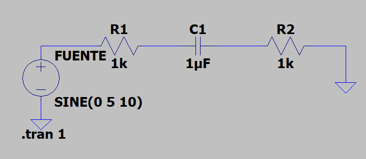

{: style="color:gray; font-size: 80%; text-align: center;"}

A pesar de los distintos tipos de condensadores que encontramos en el mercado (cerámicos, electrolíticos, con mayor capacidad de almacenaje o tolerancia) todos ellos tienen como principio fundamental la capacidad para almacenar energía eléctrica.

Sin embargo, dependiendo del lugar del circuito en el que se encuentren, su comportamiento será distinto. Hay condensadores que funcionan como un balancín para permitir la conexión entre etapas (cargándose y descargándose continuamente), y otros que actúan como filtros de señal, reduciendo su amplitud.

En esta entrada estudiaremos el comportamiento de los condensadores cuando actúan como un balancín, generando periodos de carga y descarga, y que permitirán la construcción de osciladores, capaces de generar ondas (voltaje alterno), a partir de una fuente de voltaje continua. 

Cuando estamos ante un condensador que actúa como balancín, verás que la corriente pasa por él y genera voltajes variables en los componentes cercanos.

Vamos a aprender a calcular la intensidad pico que recorre este circuito:

1. Calculamos la reactancia capacitiva
   
$$
X_c = \frac{1}{2\pi f C} = \frac{1}{2\pi * 10 * 1\times 10^{-6}}
$$
$$X_c= \frac{1}{6,28\times 10^{-5}}$$
$$X_c = 15,92 K \varOmega$$
   

2. Calculamos la impedancia total del circuito

$$Z_t = R_1+jX_c+R_2$$
$$Z_t= 1.000 \varOmega + j1.592 \varOmega + 1.000 \varOmega $$

3. Calculamos la magnitud de la impendancia total
    $$ |Z_t| = \sqrt{(R_1+R_2)^2 + X_c^2} $$
    $$ |Z_t| = \sqrt{(1K \varOmega+1K \varOmega)^2 + (15,92K \varOmega)^2} $$
    $$ |Z_t| = 16 K\varOmega $$

4. Calculamos la intensidad pico usando la Ley de Ohm

$$I_p = \frac{V_c}{|Z_t|}$$
$$I_p= \frac{5}{16\times 10^{3}}$$
$$I_p= 312 \mu A$$

En este circuito la corriente se retrasa con respecto a la tensión en 90º. Para hacer el cálculo se utiliza la siguiente fórmula:

$$ Desfase(grado) = \frac{\varDelta_t}{T}$$

Donde 
$$ \varDelta_t $$ 
es igual a la diferencia en segundos que tarda en llegar una señal al punto 0 del eje X frente a la otra.

Donde 
$$T$$
es igual al periodo de la señal, es decir, el tiempo que tarda en completar un ciclo una señal. El periodo es igual a 

$$Periodo = \frac{1}{frecuencia}$$

<html>
<head>
    <title>Convertidor de Milisegundos a Segundos</title>
    
</head>
<body>
    <h1>Convertidor de Milisegundos a Segundos</h1>
    <label for="milliseconds">Milisegundos:</label>
    <input type="number" id="milliseconds" name="milliseconds">
    <button onclick="convertToSeconds()">Convertir</button>
    

    
</body>
</html>
